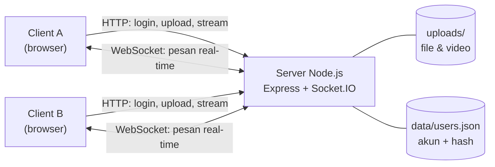
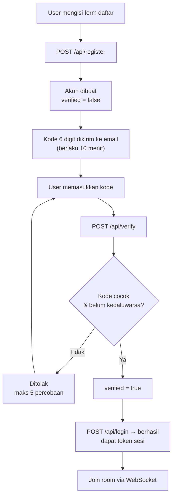
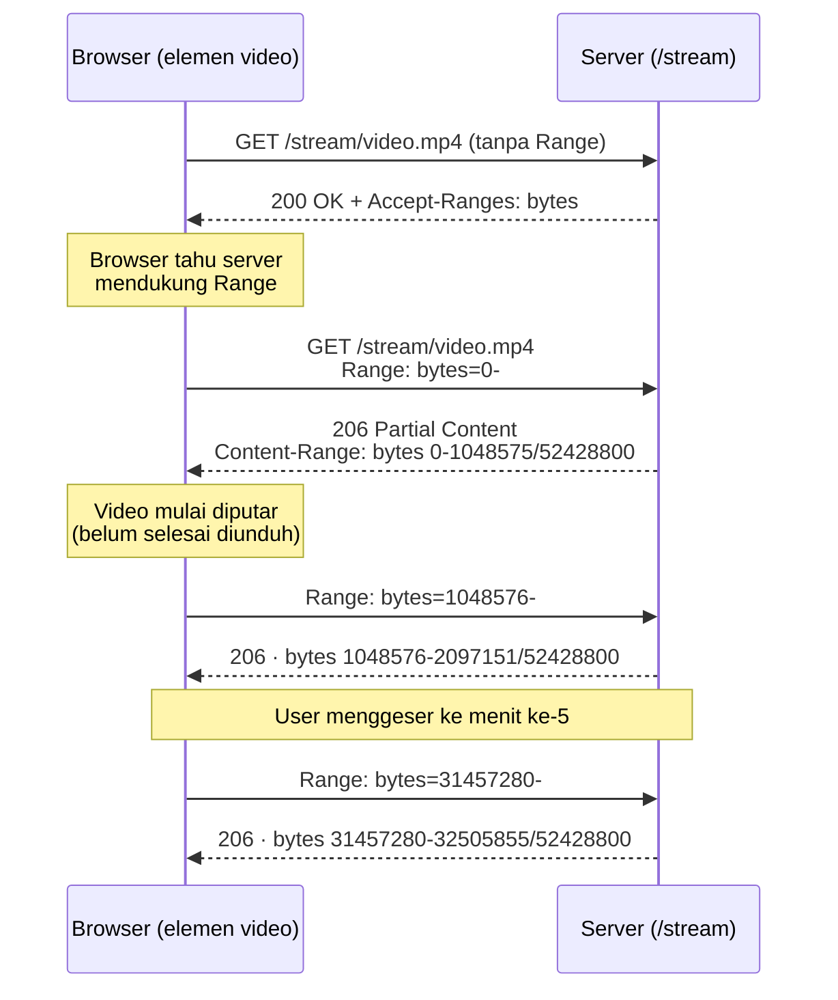

<div align="center">

# NetPruyChat

**Aplikasi chat real-time berbasis client-server**
dengan verifikasi email OTP, kirim file, dan streaming video.

[](https://nodejs.org)
[](https://expressjs.com)
[](https://socket.io)
[](#lisensi)

Tugas Akhir — Pemrograman Jaringan
**Givandra Apriliano** · 50422623 · 4IA06

</div>

---

## Daftar Isi

1. [Deskripsi](#1-deskripsi)
2. [Fitur](#2-fitur)
3. [Teknologi](#3-teknologi)
4. [Arsitektur](#4-arsitektur)
5. [Struktur Proyek](#5-struktur-proyek)
6. [Cara Menjalankan](#6-cara-menjalankan)
7. [Konfigurasi Verifikasi Email (Gmail)](#7-konfigurasi-verifikasi-email-gmail)
8. [Menjalankan di Jaringan / Hosting](#8-menjalankan-di-jaringan--hosting)
9. [Alur Verifikasi Email](#9-alur-verifikasi-email)
10. [Cara Kerja Streaming Video](#10-cara-kerja-streaming-video)
11. [Ringkasan Endpoint & Event](#11-ringkasan-endpoint--event)
12. [Keamanan](#12-keamanan)

---

## 1. Deskripsi

NetPruyChat adalah aplikasi chat berbasis web di mana banyak client (browser)
terhubung ke satu server pusat. Komunikasi memakai **dua protokol jaringan**:

| Protokol | Dipakai untuk |
|---|---|
| **HTTP** | Menyajikan halaman, autentikasi (register/verify/login/logout), upload file, dan streaming video. |
| **WebSocket** (Socket.IO) | Komunikasi chat dua arah real-time: pesan, notifikasi masuk/keluar, indikator mengetik, daftar user online. |

Registrasi tidak langsung aktif: server mengirim **kode 6 digit** ke email
pendaftar, dan akun baru bisa dipakai login setelah kode diverifikasi.

## 2. Fitur

- **Verifikasi email (OTP)** — registrasi mengirim kode 6 digit via Gmail
  (nodemailer); akun baru aktif setelah kode dimasukkan.
- **Login berbasis token sesi** — auto-login setelah refresh, terpisah per tab.
- **Password di-hash** — memakai scrypt + salt, bukan disimpan sebagai teks polos.
- **Chat teks real-time** dalam room.
- **Kirim file** — gambar, PDF, dokumen Office, teks, dan zip (maks 25 MB).
- **Kirim & streaming video** — MP4/WebM/OGG/MOV (maks 150 MB), diputar langsung
  di dalam percakapan lewat **HTTP Range Request (206 Partial Content)**,
  sehingga bisa diputar sambil dimuat dan bisa di-*seek* tanpa mengunduh seluruh
  berkas. Lihat [Bagian 10](#10-cara-kerja-streaming-video).
- **Indikator "sedang mengetik"**, daftar anggota online, dan riwayat pesan per room.
- **Penanganan kesalahan** — validasi input, tipe/ukuran file, sesi tidak valid,
  gagal koneksi, dan error tingkat proses.
- **Antarmuka gelap minimalis** — meniru design language shadcn/ui, ikon Lucide.

## 3. Teknologi

| Bagian | Teknologi |
|---|---|
| Runtime | Node.js 18+ |
| HTTP & routing | Express |
| Real-time | Socket.IO (WebSocket) |
| Upload file | Multer |
| Streaming video | HTTP Range Request (206) + `fs.createReadStream` |
| Email OTP | Nodemailer (SMTP Gmail) |
| Konfigurasi | dotenv (`.env`) |
| Keamanan password | modul `crypto` bawaan (scrypt) |

## 4. Arsitektur



Transfer file sengaja **dipisah** dari jalur chat:

1. Client meng-upload file via HTTP `POST /upload` → file disimpan ke disk.
2. Server membalas metadata file (nama, url, ukuran, tipe).
3. Client mengirim metadata itu lewat WebSocket → semua anggota room melihatnya.

Pemisahan ini membuat transfer file besar tidak membebani jalur WebSocket, dan
sekaligus menunjukkan pemakaian dua protokol secara bersamaan.

## 5. Struktur Proyek

```
server/
  server.js          Entry point: Express + Socket.IO
  config.js          Konfigurasi terpusat (port, batas file, email, dll)
  authHandler.js     Endpoint HTTP: register, verify, resend, login, logout
  userStore.js       Penyimpanan akun ke data/users.json (hash password)
  sessions.js        Token sesi login (in-memory)
  verifications.js   Kode verifikasi OTP (in-memory, kedaluwarsa 10 menit)
  mailer.js          Pengiriman email kode via nodemailer
  socketHandlers.js  Event chat real-time (join, message, typing, dll)
  chatManager.js     State chat: user per room + riwayat pesan (in-memory)
  uploadHandler.js   Endpoint upload file (multer)
  streamHandler.js   Endpoint streaming video (HTTP Range Request / 206)
public/
  index.html         Halaman (login, verifikasi, ruang chat)
  css/style.css      Tampilan (tema gelap shadcn-like)
  js/app.js          Orkestrator client (auth, kirim pesan, upload)
  js/ui.js           Render tampilan (DOM)
  js/socket.js       Pembungkus Socket.IO client
uploads/             File hasil upload
data/                users.json (dibuat otomatis)
```

## 6. Cara Menjalankan

**Prasyarat:** Node.js versi 18 atau lebih baru.

```bash
# 1. Install dependencies
npm install

# 2. Jalankan server
npm start
```

Server berjalan di **http://localhost:3000**.

Buka alamat tersebut di browser, klik **"Belum punya akun? Daftar"**, isi
username + email + password + nama room, lalu tekan **Daftar Akun**. Kode
verifikasi 6 digit dikirim ke email (atau tampil di console bila SMTP belum
diatur); masukkan kode untuk mengaktifkan akun dan otomatis masuk room.

> [!TIP]
> Untuk mensimulasikan **dua perangkat yang berkomunikasi**, buka aplikasi di dua
> tab / dua browser / dua perangkat berbeda, login dengan akun berbeda, lalu masuk
> ke **room yang sama**.

Tersedia juga `npm run dev` yang menjalankan server dengan `node --watch`
(restart otomatis setiap file diubah).

## 7. Konfigurasi Verifikasi Email (Gmail)

Untuk mengirim email OTP sungguhan, aplikasi memakai SMTP Gmail via nodemailer.

1. Aktifkan **2-Step Verification** di akun Google Anda.
2. Buka **Google Account → Security → App passwords**, buat password aplikasi
   (16 huruf).
3. Salin `.env.example` menjadi `.env`, lalu isi:

   ```ini
   SMTP_USER=emailanda@gmail.com
   SMTP_PASS=xxxxxxxxxxxxxxxx      # App Password 16 huruf, tanpa spasi
   SMTP_FROM=NetPruyChat <emailanda@gmail.com>
   ```

4. Jalankan ulang `npm start`.

> [!NOTE]
> Bila `.env` kosong, server tetap berjalan tetapi kode verifikasi hanya dicetak
> ke console — cocok untuk demo tanpa email asli. File `.env` **tidak** ikut
> di-commit karena sudah tercantum di `.gitignore`.

## 8. Menjalankan di Jaringan / Hosting

**LAN (jaringan yang sama):** jalankan server, lalu dari perangkat lain buka
`http://<IP-komputer-server>:3000` (cari IP dengan `ipconfig` di Windows).

**Akses publik via Cloudflare Tunnel:** aplikasi ini adalah server Node yang
berjalan terus-menerus dengan WebSocket, sehingga **tidak bisa** di-deploy sebagai
situs statis (Cloudflare Pages / GitHub Pages). Gunakan Cloudflare Tunnel:

```bash
npm start
# di terminal lain:
cloudflared tunnel --url http://localhost:3000
```

Cloudflared menampilkan URL publik `https://<acak>.trycloudflare.com` yang
mendukung WebSocket penuh.

## 9. Alur Verifikasi Email



Login pada akun yang belum diverifikasi akan **ditolak** dan client otomatis
diarahkan kembali ke layar pemasukan kode.

## 10. Cara Kerja Streaming Video

Mengirim video memakai jalur yang sama dengan file biasa (`POST /upload`), tetapi
**memutar**-nya memakai endpoint khusus `GET /stream/:filename` yang mendukung
**HTTP Range Request**.

### Unduh biasa vs streaming

| | Unduh biasa (`/uploads/...`) | Streaming (`/stream/...`) |
|---|---|---|
| Status | `200 OK` | `206 Partial Content` |
| Dikirim | seluruh file sekaligus | hanya potongan yang diminta (maks 1 MB) |
| Mulai diputar | setelah semua byte sampai | segera, sambil sisanya dimuat |
| Geser waktu (*seek*) | unduh ulang dari awal | cukup minta potongan lain |

### Percakapan antara browser dan server



Contoh satu siklus permintaan dalam bentuk mentah:

```http
GET /stream/video.mp4 HTTP/1.1
Range: bytes=1048576-

HTTP/1.1 206 Partial Content
Content-Type  : video/mp4
Content-Range : bytes 1048576-2097151/52428800
Content-Length: 1048576
Accept-Ranges : bytes

<1 MB data video>
```

### Catatan implementasi

Elemen `<video>` di browser mengirim header `Range` **secara otomatis** begitu
melihat respons `Accept-Ranges: bytes`, jadi tidak ada kode khusus di sisi client.

Server sengaja membatasi satu respons maksimal **1 MB** — walaupun browser
meminta `bytes=0-` yang berarti "kirim semuanya". Tanpa batas ini, satu permintaan
bisa mengirim video 150 MB sekaligus dan streaming kehilangan maknanya. Mengirim
byte lebih sedikit daripada yang diminta adalah perilaku yang **sah** menurut
[RFC 7233](https://datatracker.ietf.org/doc/html/rfc7233).

Kode ada di [`server/streamHandler.js`](server/streamHandler.js). Selain `206`,
endpoint ini menangani:

| Status | Kapan |
|---|---|
| `200 OK` | Permintaan datang tanpa header `Range`. |
| `404 Not Found` | File tidak ada. |
| `416 Range Not Satisfiable` | Rentang byte di luar ukuran file. |
| `400 Bad Request` | Nama file tidak valid. |

## 11. Ringkasan Endpoint & Event

### HTTP

| Method | Path | Fungsi |
|---|---|---|
| `GET` | `/` | Halaman aplikasi (login, verifikasi, ruang chat). |
| `POST` | `/api/register` | Daftar akun baru + kirim kode OTP. |
| `POST` | `/api/verify` | Verifikasi kode OTP. |
| `POST` | `/api/resend` | Kirim ulang kode OTP. |
| `POST` | `/api/login` | Login, mengembalikan token sesi. |
| `POST` | `/api/logout` | Menghapus token sesi. |
| `POST` | `/upload` | Upload file/video, mengembalikan metadata. |
| `GET` | `/uploads/:filename` | Unduh file (statis). |
| `GET` | `/stream/:filename` | **Streaming video (Range / 206).** |

### WebSocket (Socket.IO)

| Arah | Event | Fungsi |
|---|---|---|
| Client → Server | `join` | Masuk room memakai token sesi. |
| Client → Server | `chatMessage` | Kirim pesan teks. |
| Client → Server | `fileMessage` | Kirim metadata file hasil upload. |
| Client → Server | `typing` / `stopTyping` | Indikator mengetik. |
| Server → Client | `history` | Riwayat pesan room saat baru bergabung. |
| Server → Client | `message` | Pesan baru (teks/file/video). |
| Server → Client | `notice` | Notifikasi sistem (user masuk/keluar). |
| Server → Client | `roomUsers` | Daftar anggota online. |
| Server → Client | `typing` / `stopTyping` | Indikator mengetik dari user lain. |

## 12. Keamanan

- **Password** disimpan sebagai hash **scrypt + salt**, tidak pernah sebagai teks polos.
- **Identitas** diambil dari token sesi di sisi server, bukan dari input mentah
  client — jadi user tidak bisa mengaku sebagai orang lain lewat WebSocket.
- **Kode OTP** kedaluwarsa dalam 10 menit dan dibatalkan setelah 5 percobaan salah.
- **Upload** dibatasi berdasarkan daftar izin MIME type serta batas ukuran
  (25 MB untuk file umum, 150 MB untuk video). File yang ditolak langsung dihapus
  dari disk.
- **Path traversal** dicegah: nama file pada `/stream/:filename` disaring dengan
  `path.basename()` lalu diperiksa ulang agar hasilnya tetap berada di dalam
  folder `uploads/`. Tanpa ini, permintaan seperti `/stream/../../.env` bisa
  dipakai untuk mencuri kredensial SMTP.
- **XSS** dicegah: seluruh teks dari user di-escape sebelum masuk ke DOM, dengan
  fungsi terpisah untuk konteks teks (`escapeHtml`) dan konteks atribut
  (`escapeAttr`, yang juga meng-escape tanda kutip).
- **Kredensial** hanya dibaca dari `.env` yang tidak ikut di-commit.

---

## Lisensi

MIT — bebas dipakai dan dimodifikasi.
